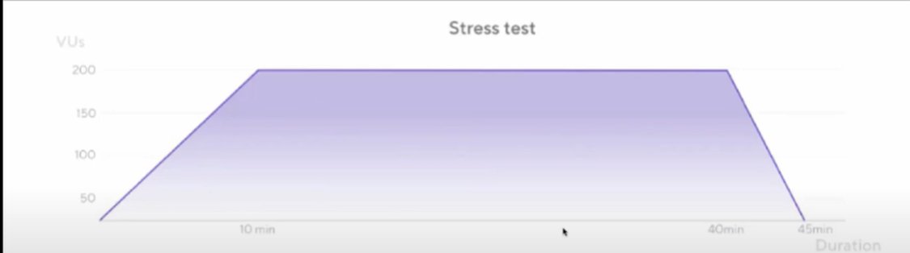

# Performance Testing with k6

## Installation  

You can install **k6** using the following methods:

### Using Winget
```sh
winget install k6
winget install --id k6.k6 -e
```

### Using Docker
```sh
docker pull grafana/k6
```

---

## Running k6  

Follow these steps to run a performance test:
1.	Run a test.
2.	Add virtual users.
3.	Increase the test duration.
4.	Ramp the number of requests up and down as the test runs.
```sh
npm init
```
Package.json gets created 

### 1. Run a Basic Test
```sh
k6 run script.js
```

### 2. Run a Test with Virtual Users (VUs)  
To simulate 10 virtual users for 30 seconds:
```sh
k6 run --vus 10 --duration 30s script.js
```

### 3. Configure Test Summary Statistics  
The end-of-test summary shows aggregated statistical values, including:  
- Median and average response times  
- Minimum and maximum response times  
- **p90, p95, and p99 values**  

To display only **median, p95, and p99.9** values:
```sh
k6 run --iterations=100 --vus=10 --summary-trend-stats="med,p(95),p(99.9)" script.js
```

---

## Shared Iterations  
In this mode, k6 shares iterations between all VUs. The test ends once all iterations are executed.
The shared-iterations executor shares iterations between the number of VUs. The test ends once k6 executes all iterations.
Iterations are not guaranteed to be evenly distributed with this executor. VU that executes faster will complete more iterations than slower VUs.

### Example:
```sh
# 10 VUs executing a total of 200 iterations
vus = 10
iterations = 200
```
Each VU executes approximately **200/10 = 20 iterations**. However, since some VUs may execute faster, the distribution is not exact.

### When to Use:
- Best for quick performance tests in the development cycle  
- Helps detect performance regressions before **QA and Production**  
- Suitable for **Shift-Left Testing** (early performance testing)
- This executor is suitable when you want a specific number of VUs to complete a fixed number of total iterations, and the amount of iterations per VU is unimportant. If the time to complete a number of test iterations is your concern, this executor should perform best.
- An example use case is for quick performance tests in the development build cycle. As developers make changes, they might run the test against the local code to test for performance regressions. Thus the executor works well with a shift-left policy, where emphasizes testing performance early in the development cycle, when the cost of a fix is lowest.
---

## Per VU Iterations  
In this mode, each VU executes an exact number of iterations.
Here each user will take exactly 20 iterations , equally distributed 

### Example:
```sh
# 10 VUs executing exactly 20 iterations each
vus = 10
iterations = 200  # (Each VU gets exactly 20 iterations)
```
Here, iterations are **evenly distributed** across VUs.

### When to Use:
- Useful when you need VUs to execute an equal number of iterations  
- Ideal for **fixed sets of test data** where partitioning is needed  
- Use this executor if you need a specific number of VUs to complete the same number of iterations. This can be useful when you have fixed sets of test data that you want to partition between VUs.
---

## Performance Metrics  

### **90th Percentile (p90)**  
- In load testing, the 90th percentile is a measure of the performance of a system under test.
- It represents the point at which 90% of all observed response times are equal to or less than the specified time. For example, if the 90th percentile response time for a particular test is 500 milliseconds, this means that 90% of all requests made during the test were completed in 500 milliseconds or less, while the other 10% took longer.
- This is often used as a metric to evaluate the overall performance of a system and to identify potential bottlenecks or issues.

The **90th percentile** measures system performance under load. It indicates that **90% of response times are below or equal to a specified time**.  
Example:  
If p90 = **500ms**, then **90% of requests complete within 500ms**, while the remaining 10% take longer.

### **95th Percentile (p95)**  
The 95th percentile, like the 90th percentile, is a measure of performance in load testing.
- It represents the point at which 95% of all observed response times are equal to or less than the specified time.
- In other words, if the 95th percentile response time for a particular test is 500 milliseconds, this means that 95% of all requests made during the test were completed in 500 milliseconds or less, while the other 5% took longer.
The **95th percentile** indicates that **95% of response times are below or equal to a specified time**.  
Example:  
If p95 = **500ms**, then **95% of requests complete within 500ms**, while the remaining 5% take longer.

---

## Stress Testing  
Stress testing helps evaluate **system stability under extreme load**. The load starts at **0 VUs** and **gradually increases** beyond normal levels.
### Stress Testing: check performance of app under extreme load, starts at 0 and increases beyond the point tested in the average load type.
- Start with 0 virtual users and ramp up to 200 vus. In average load type we stay there for duration like 10 mins, but in stress test we stay for longer time and also ramp up and down periods are also longer as compared to average load type, as it allows u to give more realistic approach.
- Stress test can be done after smoke and average load test because in stress test we are checking with 200 VUS for 40 minutes, and if APIs are not working then, it doesn’t makes any sense ,so check api and build is fine 
- Checks stability of systems under extreme load where you gradually increase the load until u reach a point where the system starts to show signs of stress or potential issues.

### **Example Scenario**
- Start with **0 virtual users**  
- Ramp up to **200 VUs**  
- Stay at peak load for **40 minutes**  
- Gradually ramp down  

#### **When to Perform Stress Testing?**
- **Before launching a new product**  
- **Before major updates to an existing product**  
- **During high-traffic events (e.g., Black Friday, Holiday Sales)**  
- **For financial applications to handle high transaction volumes**  

### **Best Practice**
Stress testing should be done **after** smoke and average load testing.  
If APIs fail at normal load, stress testing **isn't meaningful**.  

---

## Image Reference  


